# **Hasarlı Araç Tahmini ve Görüntü İşleme Projesi**

 **Proje Hakkında**  
Bu proje, hasarlı araç görüntülerini sınıflandırmak için beş farklı derin öğrenme tabanlı transformatör modeli kullanmayı amaçlamaktadır. Veriler, modellerin performans metriklerine göre analiz edilmiş ve sonuçlar karşılaştırılmıştır.

---

##  **Özellikler**
- **Beit**, **Swin**, **Deit**, **VGG16**, ve **ConvNext** modelleriyle sınıflandırma.  
- **Performans Analizi:**  
  - Accuracy, Recall, Precision, Sensitivity, Specificity, F-Score, AUC değerleri.  
- **Grafikler:**  
  - Eğitim/test için epoch vs. loss grafikleri.  
  - Karmaşıklık matrisi ve ROC eğrileri.  
- **Zaman Ölçümleri:**  
  - Eğitim zamanı (training time) ve çıkarım zamanı (inference time).  
- **Raporlama:** IEEE konferans şablonuna uygun detaylı rapor.

---

## **Geliştirme Ortamı**
- **Programlama Dili:** Python  
- **Derin Öğrenme Frameworkleri:**  
  - PyTorch  
  - TensorFlow
  - Keras
- **Kullanılan Kütüphaneler:**  
  - `numpy`, `pandas`, `matplotlib`, `seaborn`  
  - `scikit-learn`, `torchvision`, `tqdm`  
  - `transformers` 
- **Donanım:** Google Colab GPU

##  **Proje Yapısı**
```plaintext
.
├── Google Colab/            # Model eğitim kodları ve Model ile ilgili performans analizleri, grafikler, çıktılar ve metrikler
├── Google Drive/            # Modeli eğitmek için Crawler ile çekilen veriler, Veri setleri              
├── README.md                # Proje açıklamaları
├── Rapor/                   # IEEE şablonuna uygun rapor
```

##  **Kurulum ve Çalıştırma**

###  **Depoyu Klonlayın**  
Terminal veya komut satırında aşağıdaki komutları çalıştırarak projeyi klonlayın:  
```bash
git clone https://github.com/ibrahimbugrasan/HasarliAracTespiti-2.git
cd HasarliAracTespiti-2
```
###  **Veri Setine Erişim**

Projede kullanılan veri seti, **Google Drive** üzerinde aşağıdaki dizinde saklanmaktadır:  
**`YazLabProjesi/DATABASE`**

Google Colab ortamında geliştirilen projenizden bu verilere erişmek için şu adımları izleyin:  

### 1. **Google Drive'ı Bağlayın:**  
Google Colab'de, Drive'ınızı bağlamak için aşağıdaki kodu çalıştırın:  
```python
from google.colab import drive
drive.mount('/content/drive')
```
### 2️. **Veri Seti Yolunu Doğrulayın**  
Bağlantı başarılı olduktan sonra, veri setinin doğru dizinde olduğundan emin olun:  

- **Terminal veya Dosya Gezgini ile Doğrulama:**  
  Aşağıdaki yolun doğru olduğundan emin olun:  
  ```python
  /content/drive/My Drive/YazLabProjesi/DATABASE

### 3. **Google Colab’de Modeli Çalıştırın**

1. **Proje Klasöründeki Google Colab Modelleri**  
   Proje klasöründe yer alan eğitim dosyasını açın.  
   Örnek: `train_beit.ipynb`

2. **Kod Satırını Çalıştırın**  
   Kod satırını çalıştırarak modeli eğitin.

3. **Eğitim Sonuçları**  
   Eğitim tamamlandığında, modelin çıktıları ve sonuçları görüp diğer model çıktılarıyla karşılaştırabilirsiniz.

---

### **Arayüz Görselleri**  

Proje arayüzüne ait örnek görseller aşağıda yer almaktadır. Bu görseller, geliştirilen arayüzün nasıl göründüğünü ve kullanıcı etkileşimlerini göstermek amacıyla kullanılmaktadır.

1. **Swin Modeli ROC Görselleştirmesi**  
   

2. **Swin Modeli Train-Test Görselleştirmesi**  
   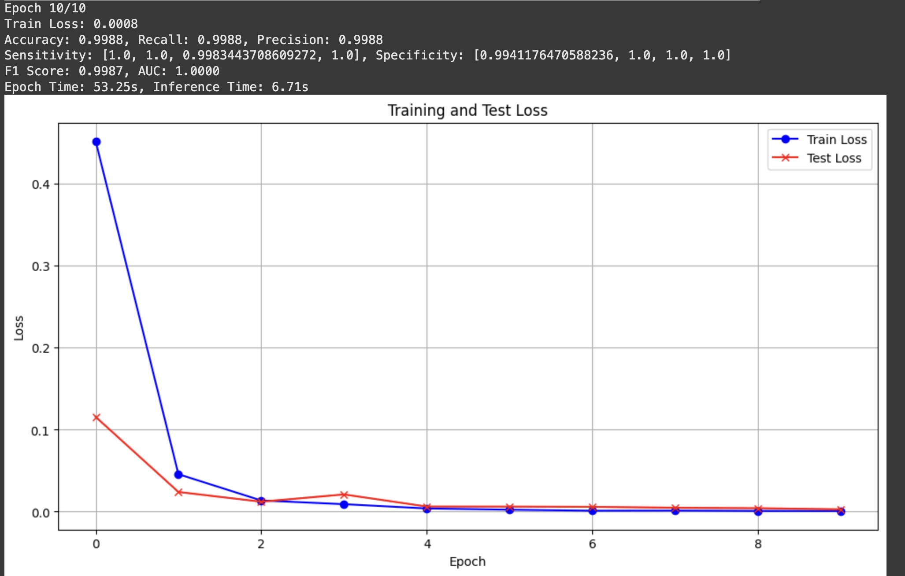

3. **Swin Modeli Matrix Görselleştirmesi**  
   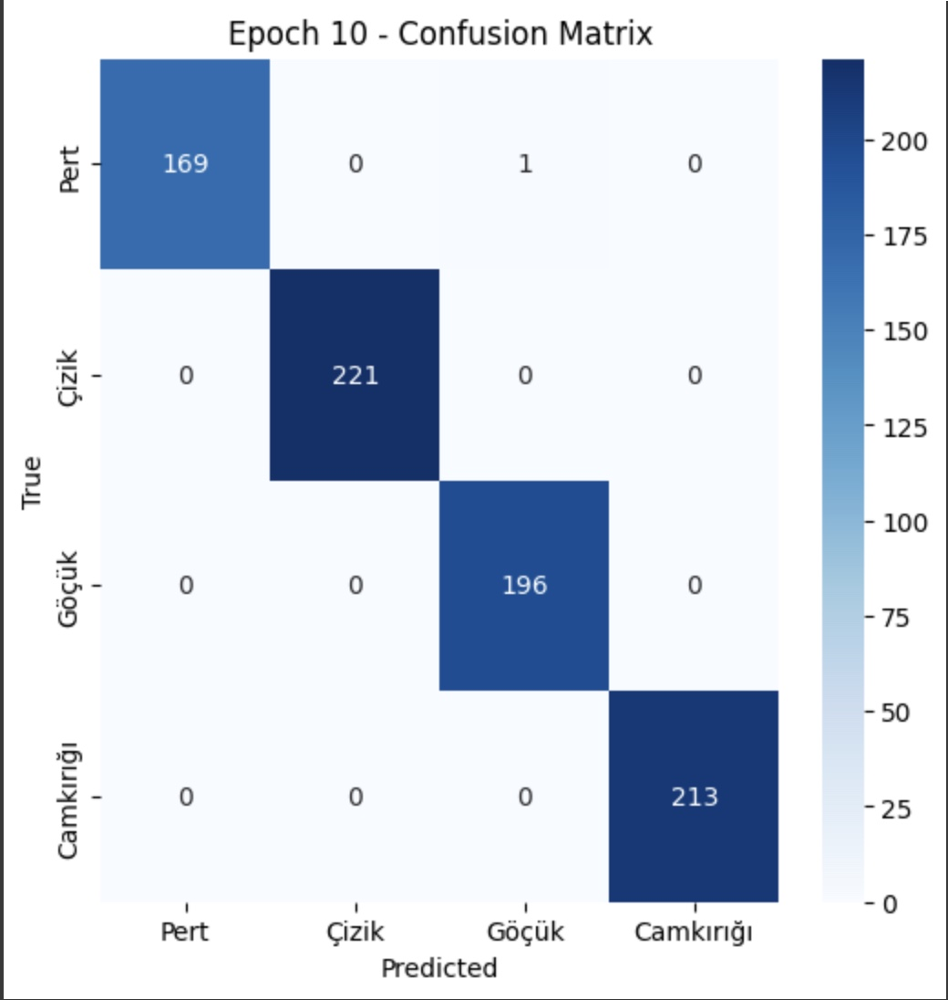

4. **Beit Modeli ROC Görselleştirmesi**  
   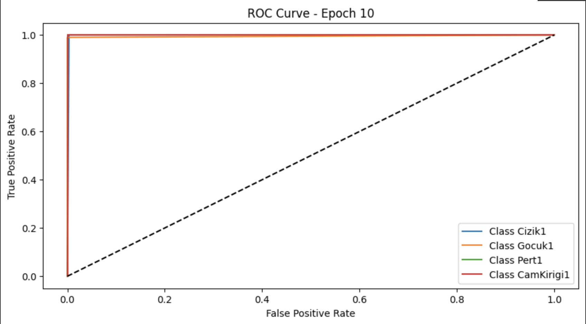

5. **Beit Modeli Train-Test Görselleştirmesi**  
   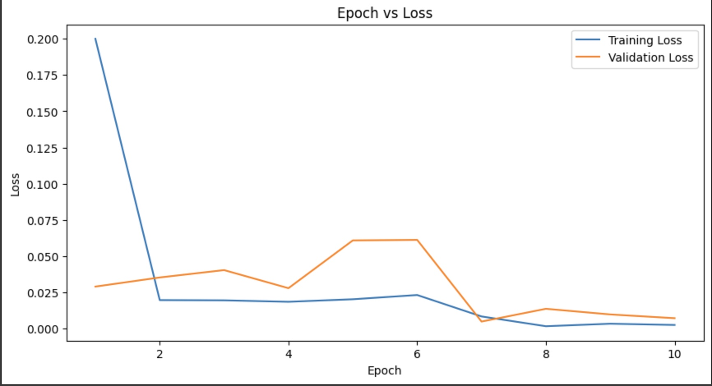

6. **Beit Modeli Matrix Görselleştirmesi**  
   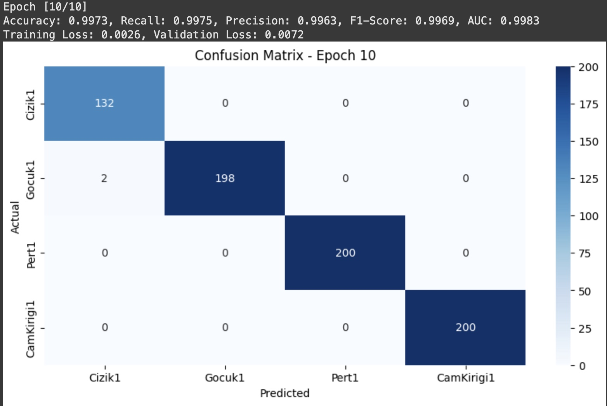

7. **ConvNext Modeli ROC Görselleştirmesi**  
   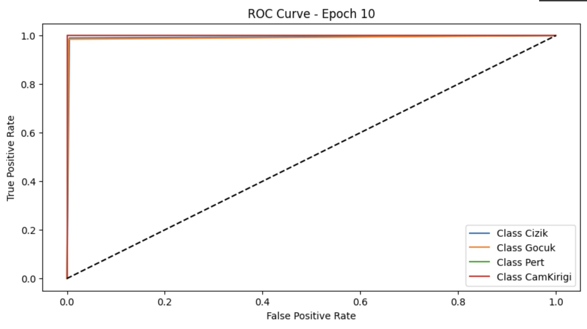

8. **ConvNext Modeli Train-Test Görselleştirmesi**  
   

9. **ConvNext Modeli Matrix Görselleştirmesi**  
   

10. **VGG16 Modeli ROC Görselleştirmesi**  
   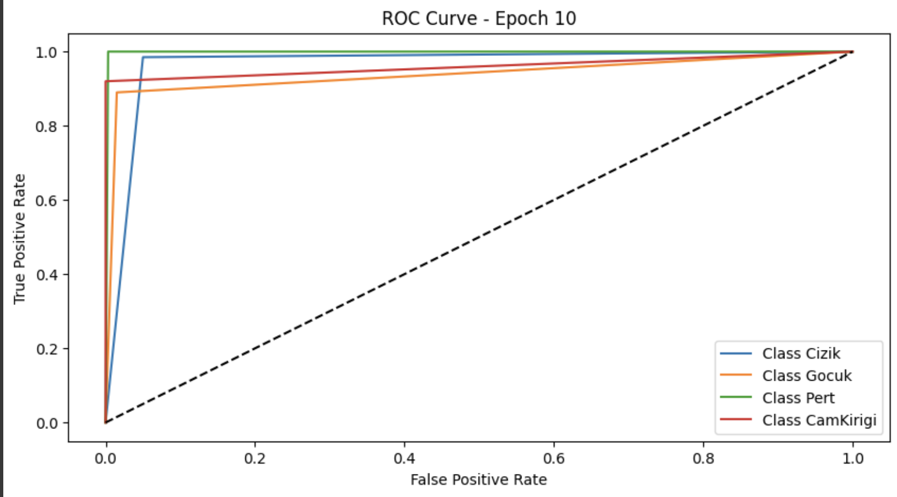

11. **VGG16 Modeli Train-Test Görselleştirmesi**  
   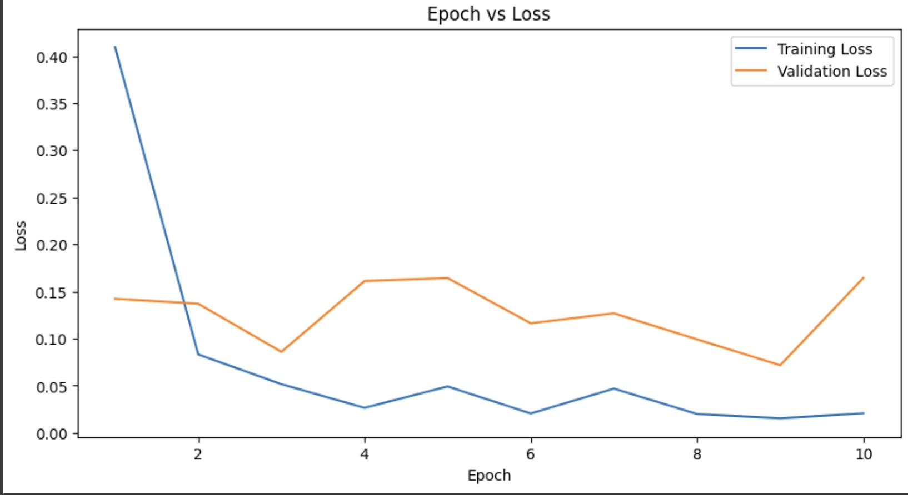

12. **VGG16 Modeli Matrix Görselleştirmesi**  
   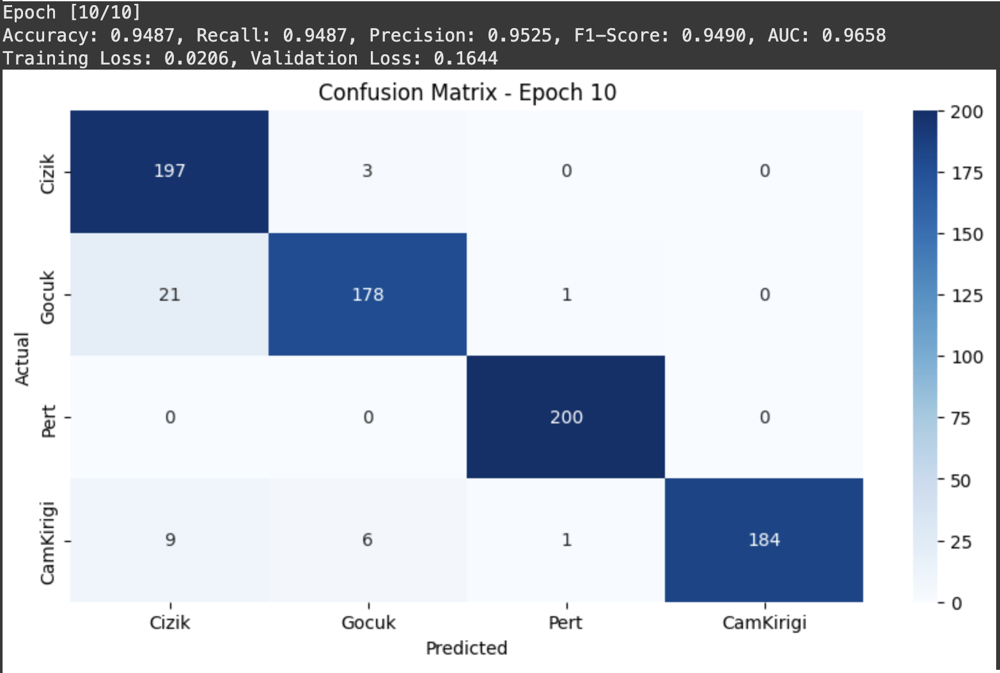

13. **Deit Modeli ROC Görselleştirmesi**  
   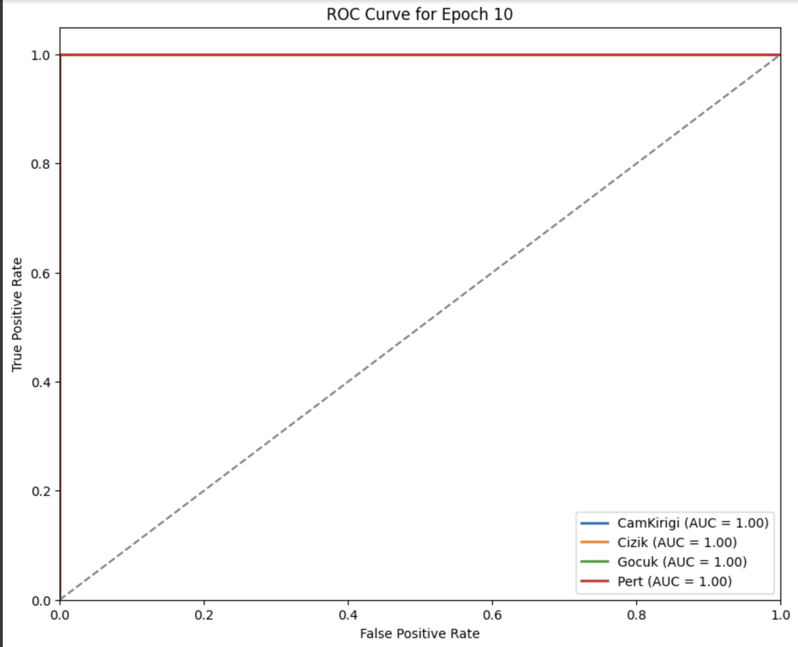

14. **Deit Modeli Train-Test Görselleştirmesi**  
   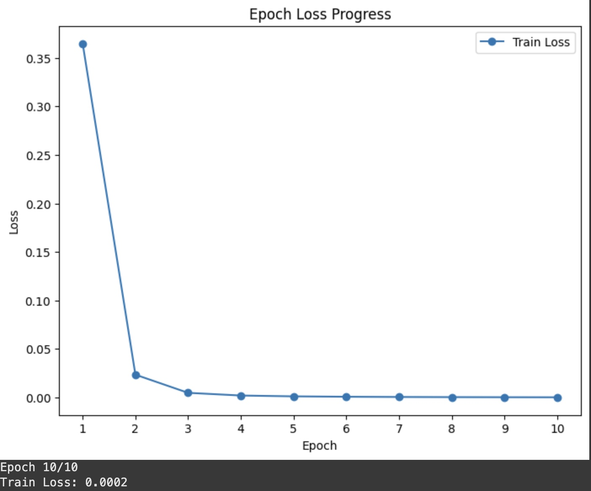

15. **Deit Modeli Matrix Görselleştirmesi**  
   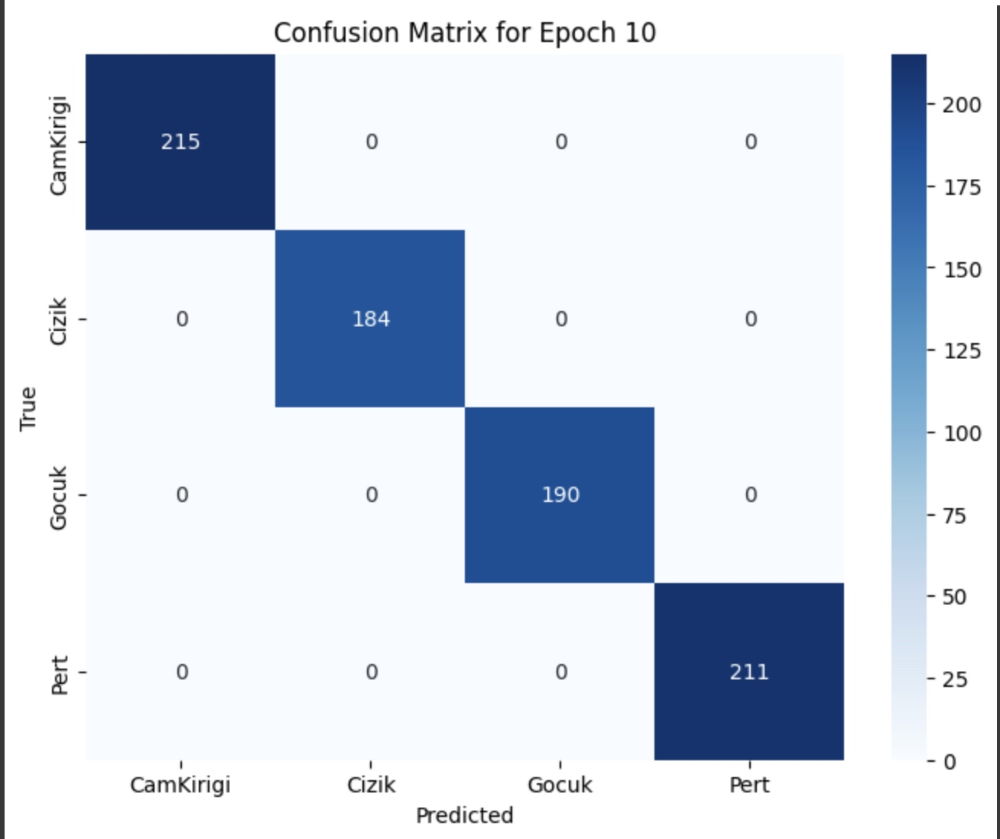

---

###  **İletişim**  

Herhangi bir soru veya geri bildirim için aşağıdaki iletişim bilgilerini kullanabilirsiniz:  
- **Ad Soyad:** İbrahim Buğra San  -  Esat Berat Uzunca 
- **E-posta:** ibugrasan@gmail.com  -  uzuncaaesat@gmail.com
- **LinkedIn:** www.linkedin.com/in/ibrahimbugrasan  -  https://www.linkedin.com/in/esat-berat-uzunca-14a794258/
- **GitHub::** https://github.com/ibrahimbugrasan  -  https://github.com/uzuncaesat

---

###  **Lisans**  

Bu proje **MIT Lisansı** ile lisanslanmıştır. Daha fazla bilgi için [LICENSE](./LICENSE) dosyasına göz atabilirsiniz.

---
   


